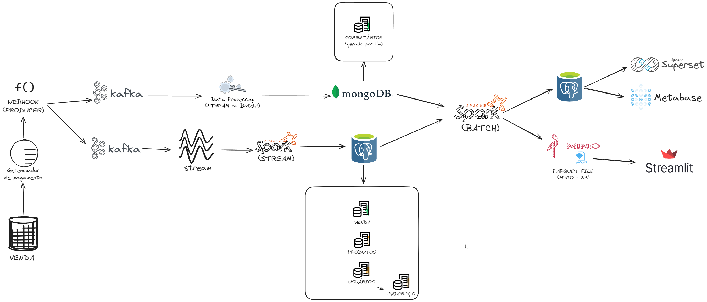

**Pipeline de Dados em Ecossistema de Comércio Eletrônico**
=====================================
Um projeto para explorar os diversos pipelides de dados presentes em um ecossistema de e-commerce.

### Propósito

Este projeto tem o objetivo de fornecer um ambiente de experimentação com pipelines de dados. Nos permite, de maneira escalável e confiável, coletar, processar e analisar dados de comércio eletrônico, permitindo explorar a criação de insights e tomada de decisões baseadas em dados que simulam um ambiente real.

### Recursos

* Consome dados de diversas origens (estruturado e não estruturado)
* Transforma e processa dados para análise e relatórios
* Cria um painel com análises e relatórios

### Tecnologias

* PostgreSQL como banco de dados relacional
* Apache Spark para processamento dos dados em stream e batch
* Apache Kafka como mensageiro
* Streamlit para criação de paineis

### Arquitetura



## Como Usar

Siga os passos abaixo para clonar o repositório, criar o ambiente virtual, instalar as dependências e executar o projeto:

### 1. Clone o Repositório

Para começar, clone este repositório em sua máquina local usando o comando abaixo:

```bash
git clone git@github.com:kandarpagalas/ecommerce-data-pipeline.git
```

### 2. Instale as Bibliotecas Necessárias

Certifique-se de que você tem as seguintes bibliotecas instaladas para criar e gerenciar o ambiente virtual Python:

- Python 3.x
- `venv` (incluído no Python 3.x)
- `pip` (geralmente incluído no Python 3.x)

### 3. Crie um Ambiente Virtual

Navegue até o diretório do projeto e crie um ambiente virtual Python:

```bash
python3 -m venv venv
```

### 4. Ative o Ambiente Virtual

Ative o ambiente virtual. O comando pode variar dependendo do sistema operacional que você está usando:

**Windows:**

```bash
venv\Scripts\activate
```

**Linux/MacOS:**

```bash
source venv/bin/activate
```

### 5. Instale as Dependências

Com o ambiente virtual ativado, instale todas as dependências necessárias:

```bash
pip install -r .\requirements.txt
```

### 6. Inicie os Serviços com Docker Compose

Utilize o Docker Compose para subir os serviços necessários. Substitua `\caminho_arquivo` pelo caminho do arquivo `docker-compose.yml` específico do projeto:

```bash
docker-compose -f \caminho_arquivo up -d
```

### 7. Execute a Interface Gráfica do Streamlit

Finalmente, execute a interface gráfica do Streamlit para produzir os pedidos:

```bash
streamlit run \streamlit_app.py
```

Esse conteúdo em formato Markdown pode ser diretamente inserido no arquivo README.md do seu projeto.

### Idealizador do projeto

* [Kandarpa Galas](https://github.com/kandarpagalas/) 

### Contribuidores
* [Felipe Soares](https://github.com/felipesoaresdev/)
* [Winiston Freitas]()
* [Érica Monteiro]()

### Licença

Este projeto é licenciado sob a [Licença Apache 2.0](LICENSE).