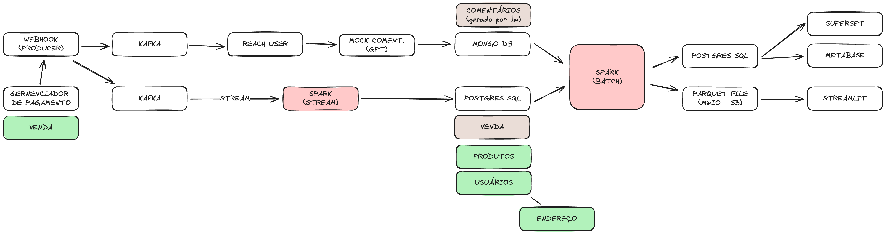

**Pipeline de Dados em Ecossistema de Comércio Eletrônico**
=====================================
Um projeto para explorar os diversos pipelides de dados presentes em um ecossistema de e-commerce.

### Propósito

Este projeto tem o objetivo de fornecer um ambiente de experimentação com pipelines de dados. Nos permite, de maneira escalável e confiável, coletar, processar e analisar dados de comércio eletrônico, permitindo explorar a criação de insights e tomada de decisões baseadas em dados que simulam um ambiente real.

### Recursos

* Consome dados de diversas origens (estruturado e não estruturado)
* Transforma e processa dados para análise e relatórios
* Cria um painel com análises e relatórios

### Tecnologias

* PostgreSQL como banco de dados relacional
* Apache Spark para processamento dos dados em stream e batch
* Apache Kafka como mensageiro
* Streamlit para criação de paineis

### Arquitetura

### Idealizadores do projeto
<!-- * [Érica Monteiro]()-->
* [Felipe Soares](https://github.com/felipesoaresdev/)
* [Kandarpa Galas](https://github.com/kandarpagalas/) 
<!-- * [Winiston Freitas]() -->

### Licença

Este projeto é licenciado sob a [Licença Apache 2.0](LICENSE).